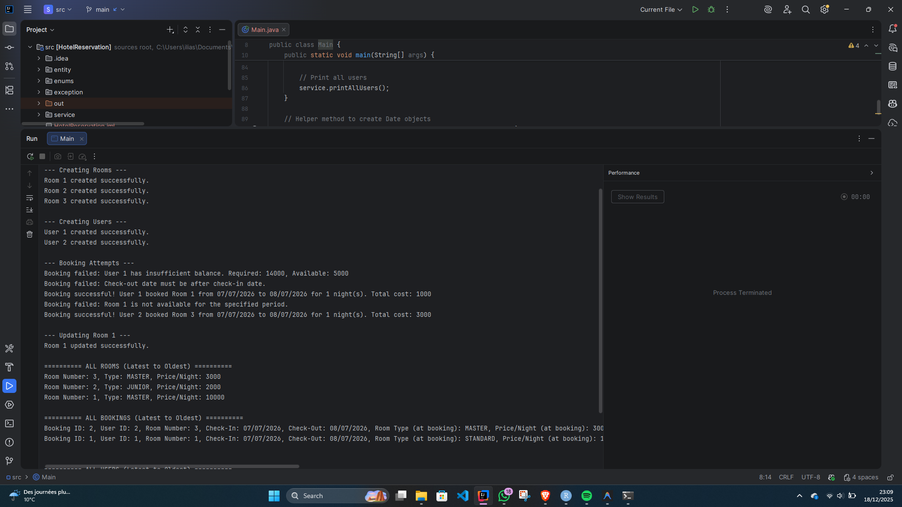

# Hotel Reservation System

A simple Java console application for managing hotel room bookings.

## Features
- Create and update rooms (Standard, Junior, Master suites)
- Create and update users with balance
- Book rooms with date validation and availability checking
- View all rooms, users, and bookings

## How to Run
1. Open `HotelReservation` folder in IntelliJ IDEA
2. Mark `src` as Sources Root
3. Run `Main.java`

## Output


## Project Structure
```
HotelReservation/src/
├── Main.java
├── entity/       (User, Room, Booking)
├── enums/        (RoomType)
├── exception/    (Custom exceptions)
└── service/      (Service interface & implementation)
```
